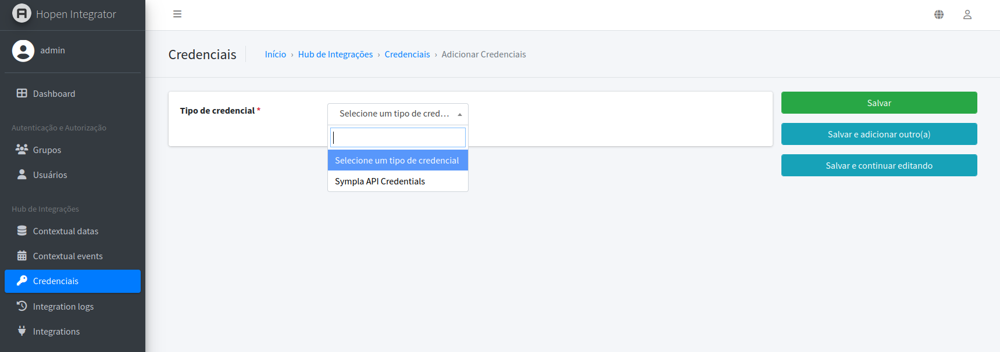
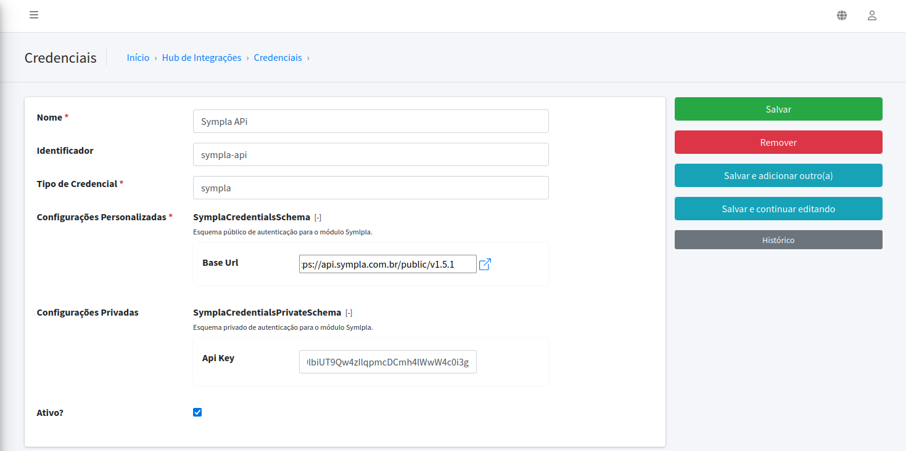
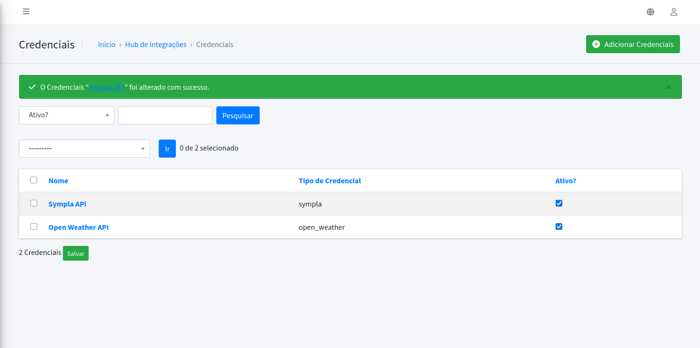
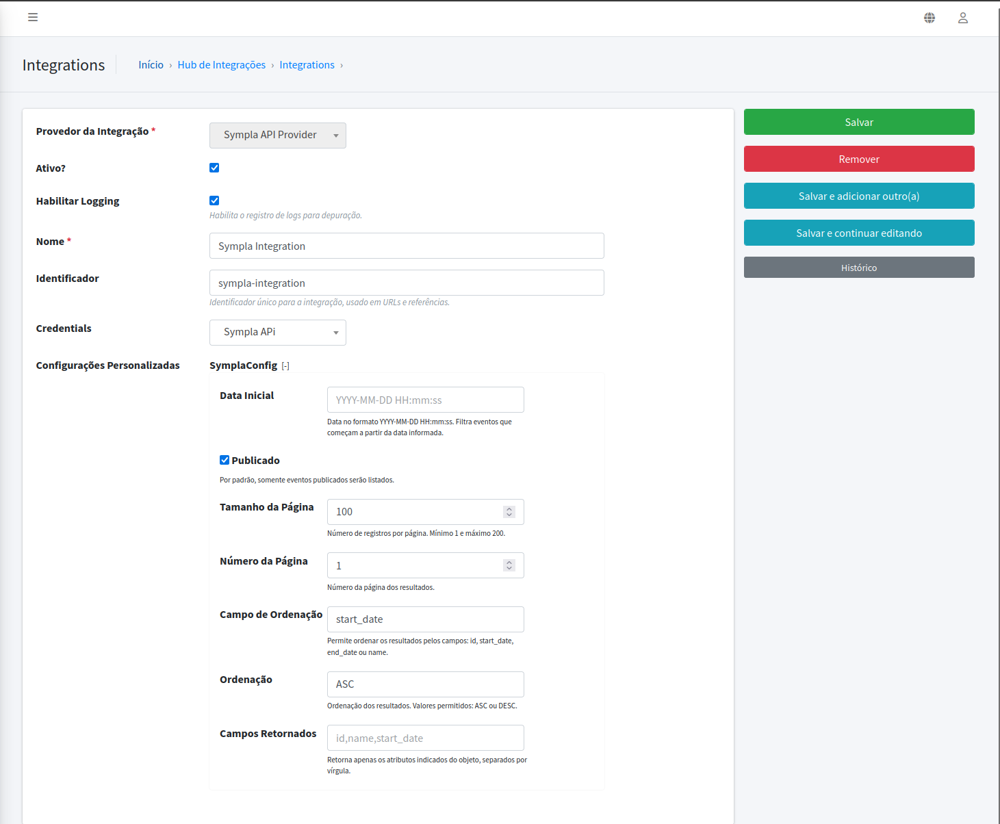
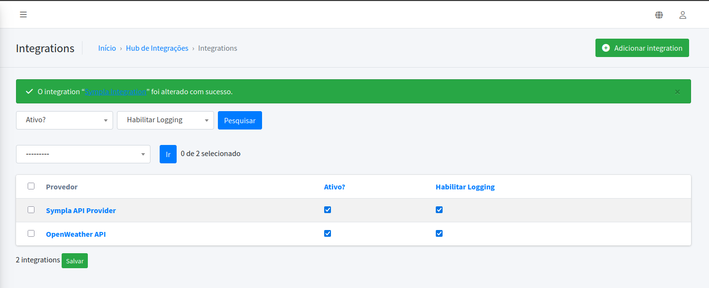
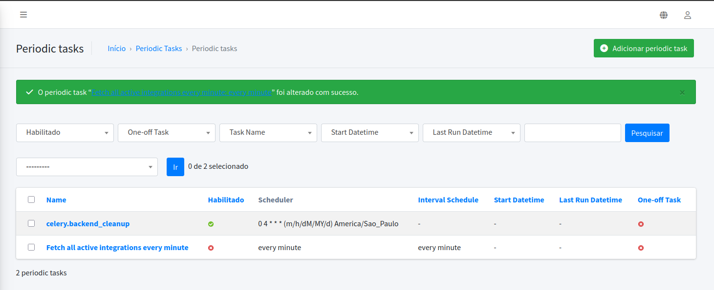
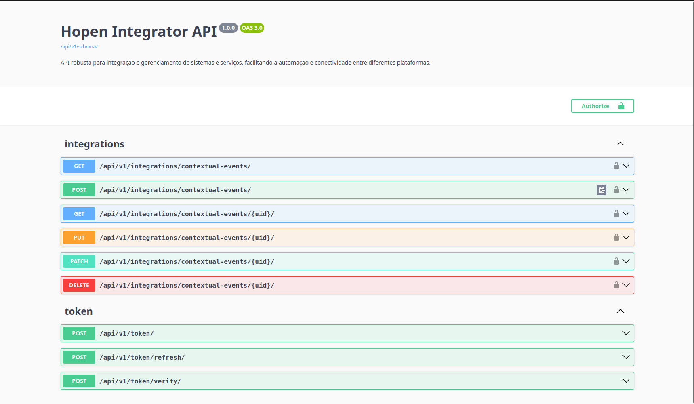

# 🚀 **Hopen Integrator**

## 📝 **Descrição do Projeto**

Hopen Integrator é uma solução moderna para integrar diferentes sistemas e serviços, facilitando a importação e
exportação de dados entre eles. Utilizando tecnologias como **Django**, **Django Rest Framework** e **Celery**, o
projeto garante escalabilidade, confiabilidade e flexibilidade.

---

## 🌟 **Funcionalidades**

- 🔗 Integrações com múltiplas APIs e serviços externos.
- ⏰ Agendamento de tarefas periódicas com **Celery Beat**.
- 📊 Monitoramento de resultados de tarefas no **Django Admin**.
- 🛠️ Suporte a múltiplas filas de prioridade para execução de tarefas.

---

## 🛠️ **Tecnologias Utilizadas**

- **Django**: Framework web para desenvolvimento rápido e escalável.
- **Django Rest Framework**: Para construção de APIs RESTful.
- **Celery**: Para execução assíncrona de tarefas.
- **RabbitMQ**: Broker de mensagens para gerenciamento de filas de tarefas.
- **PostgreSQL**: Banco de dados relacional para armazenamento de dados.
- **Docker**: Para containerização e fácil implantação do projeto.

---

## 📋 **Processo de Desenvolvimento**

### 1️⃣ Planejamento

- Identificação das necessidades de integração entre sistemas.
- Definição dos requisitos funcionais e não funcionais.
- Escolha das tecnologias e ferramentas a serem utilizadas.

### 2️⃣ Desenvolvimento

- Implementação de APIs REST para comunicação entre sistemas.
- Configuração de tarefas assíncronas e agendadas com **Celery** e **Django Celery Beat**.
- Criação de modelos e serializers para manipulação de dados.

### 3️⃣ Implantação

- Configuração de variáveis de ambiente e banco de dados.
- Containerização do projeto com **Docker**.
- Implantação em ambiente de produção com monitoramento e logs.
- Configuração de segurança e autenticação.

---

## ⚠️ **Desafios**

### 🔄 Gerenciamento de Tarefas Periódicas

- Implementar o **Celery Beat** para agendamento de tarefas periódicas, garantindo que as tarefas sejam executadas em
  intervalos regulares e possam ser monitoradas pelo **Django Admin**.

### 📈 Escalabilidade e Desempenho

- Utilizar **RabbitMQ** como broker de mensagens para gerenciar filas de tarefas, permitindo que o sistema escale
  horizontalmente e suporte um grande volume de tarefas sem comprometer o desempenho.

### 🔒 Segurança e Autenticação

- Proteção das APIs com autenticação JWT, garantindo que apenas usuários autorizados possam acessar os recursos.
- Gerenciamento de permissões e roles para controlar o acesso a diferentes funcionalidades do sistema.

---

## 🔮 **Possíveis Extensões Futuras**

- 🖥️ Implementação de um painel de controle para visualização e gerenciamento das integrações.
- 🌐 Suporte a mais serviços e APIs para ampliar as possibilidades de integração.
- 📡 Adicionar integração com **WebSockets** para comunicação em tempo real ou **GraphQL** para consultas mais flexíveis.
- 🔔 Notificações em tempo real para eventos importantes, como falhas em integrações ou conclusão de tarefas.

---

## 🧩 Plugin Architecture

O Hopen Integrator utiliza uma arquitetura de plugins para facilitar a adição de novos módulos e integrações. Cada
plugin é composto por dois componentes principais:

- **Credenciais**: Módulo responsável por gerenciar as credenciais necessárias para autenticação com o serviço externo.
- **Provedor**: Módulo responsável por implementar a lógica de integração com o serviço externo, incluindo a busca e
  normalização dos dados.

O sistema reconhece automaticamente novos plugins cadastrados, permitindo que sejam facilmente registrados e utilizados
na classe base de integração. `BaseCredentialsType` e `BaseProviderBackend`, e o registrador `PluginRegistry`, permite
que
os desenvolvedores criem novos módulos de credenciais e provedores de forma rápida e eficiente.


---

## 🛠️ **Como Utilizar**

### **Pré-requisitos**

- 🐍 Python
- 🐳 Docker e Docker Compose
- 🐇 RabbitMQ
- 🐘 PostgreSQL
- 🦄 Django
- 🌐 Django Rest Framework
- ⚙️ Celery
- ⏰ Django Celery Beat

---

### **Cadastrar Novos Módulos e Integrações**

Para cadastrar novas integrações no sistema, siga os passos abaixo:

---

#### **1️⃣ Criar um Novo Módulo de Credenciais**

1. No App `integrations`, dentro de `credentials` crie uma nova pasta com o nome do módulo desejado, por exemplo,
   `symlpla`.
2. Dentro dessa pasta, crie os arquivos `credentials.py` e `schema.py`.

##### **Arquivo `credentials.py`**

```python
from integrations.credentials.sympla.schema import SymplaCredentialsSchema, SymplaCredentialsPrivateSchema

from integrations.credentials.base import BaseCredentialsType


class SymplaCredentials(BaseCredentialsType):
    """
    Classe de credenciais para o módulo Symlpla.
    """
    id = "sympla"
    name = "Sympla API Credentials"

    def __init__(self, instance):
        super().__init__(instance)

    @classmethod
    def get_credentials_schema(cls):
        return SymplaCredentialsSchema

    @classmethod
    def get_credentials_private_schema(cls):
        return SymplaCredentialsPrivateSchema

    def validate_credentials(self, credentials):
        private_data_obj = self.get_credentials_type_private_data_obj()
        if hasattr(private_data_obj, "api_key"):
            return private_data_obj.api_key
        raise AttributeError("O atributo 'api_key' não está definido no objeto retornado.")
```

##### **Arquivo `schema.py`**

```python
from pydantic import BaseModel, HttpUrl, constr, field_validator


class SymplaCredentials(BaseModel):
    """
    Esquema público de autenticação para o módulo Symlpla.
    """
    base_url: HttpUrl


class SymplaCredentialsPrivateSchema(BaseModel):
    """
    Esquema privado de autenticação para o módulo Sympla.
    """
    api_key: constr(min_length=1, max_length=64)

    @field_validator("api_key")
    def validate_api_key(cls, value):
        if not value:
            raise ValueError("A API Key é obrigatória.")
        return value
```

---

#### **2️⃣ Registrar o Módulo no Django Admin**

Após criar o módulo de credenciais, o sistema reconhecerá automaticamente um novo plugin cadastrado. Para registrar o
módulo
no Django Admin, siga os passos abaixo:

Ao criar uma nova credencial, aparecerá um novo plugin do tipo de credenciais no Django Admin, permitindo que você
escolha e salve.



Após salvar, o módulo aparecerá na lista de credenciais disponíveis, selecione o recém criado para cadastrar as
credenciais conforme criou os schemas e salve novamente.



Ficará disponível para uso nas integrações.


#### **1️⃣ Criar um Novo Módulo de Provedor**

1. No App `integrations`, em `providers` crie uma nova pasta com o nome do provedor, por exemplo, `sympla`.
2. Dentro dessa pasta, crie os arquivos `provider.py` e `config.py`.

##### **Arquivo `config.py`**

```python
from typing import Optional

from pydantic import BaseModel, Field


class SymplaConfig(BaseModel):
    from_date: Optional[str] = Field(
        None,
        title="Data Inicial",
        examples=["2023-01-01 00:00:00"],
        json_schema_extra={
            "placeholder": "YYYY-MM-DD HH:mm:ss",
            "help_text": "Data no formato YYYY-MM-DD HH:mm:ss. Filtra eventos que começam a partir da data informada."
        }
    )
    published: Optional[bool] = Field(
        True,
        title="Publicado",
        json_schema_extra={
            "help_text": "Por padrão, somente eventos publicados serão listados."
        }
    )
```

##### **Arquivo `provider.py`**

```python
from integrations.providers.base import BaseProviderBackend
from integrations.credentials.sympla.credentials import SymplaCredentials
from integrations.providers.sympla.config import SymplaConfig


class SymplaProvider(BaseProviderBackend):
    """
    Provedor de integração para o módulo Symlpla.
    """
    id = "sympla"
    name = "Sympla API Provider"
    category = "event_management"
    allowed_credentials_types = ["sympla"]

    def __init__(self, integration=None, credentials=None):
        credentials = SymplaCredentials(credentials)
        super().__init__(integration=integration, credentials=credentials)

    @classmethod
    def get_schema_dict(cls, integration=None):
        return cls.get_provider_backend_data_config().model_json_schema()

    @classmethod
    def get_provider_backend_data_config(cls):
        """
        Retorna a configuração de dados do provedor.
        """
        return SymplaConfig

    def normalize(self, raw_data: dict) -> dict:
        """
        Método para normalizar os dados brutos recebidos da API do Symlpla.
        """
        # Implementar a lógica de normalização dos dados aqui
        return raw_data

    def fetch(self):
        """
        Método para buscar eventos na API do Symlpla.
        """
        pass
```

#### **2️⃣ Registrar o Módulo no Django Admin**

Após criar o módulo do provedor, o sistema reconhecerá automaticamente um novo plugin cadastrado. Para registrar o
módulo no Django Admin, siga os passos abaixo:

Ao criar uma nova integração, aparecerá um novo plugin do tipo de provedor no Django Admin, permitindo que você
escolha e salve.


Após salvar, o módulo aparecerá na lista de provedores disponíveis, selecione o recém criado para cadastrar as
credenciais conforme criou os schemas e salve novamente.



Ficará disponível para uso nas integrações.



---

### ⏰ **Uso do Celery Beat**

O **Celery Beat** é utilizado para agendar tarefas periódicas no projeto, permitindo que elas sejam executadas
automaticamente em intervalos definidos. A configuração pode ser feita diretamente no arquivo de configurações do
Django (`settings.py`) ou via **Django Admin**.

---

## 🛠️ Configuração e Utilização da Task: fetch_all_active_integrations

Essa task é responsável por buscar todas as integrações ativas no sistema e processar os dados de cada uma delas. Ela
pode ser configurada para ser executada periodicamente utilizando o **Celery Beat**.

Ela busca das dos providers registrados no sistema, e executa a função `fetch` de cada um deles, que deve ser
implementada para buscar os dados necessários.

### **Configuração via Django Admin**

Para configurar tarefas periódicas utilizando o **Django Admin**, siga os passos abaixo:

1️⃣ **Acesse o Django Admin**:

- Certifique-se de que o servidor está rodando e acesse `http://localhost:8000/admin`.

2️⃣ **Navegue até Periodic Tasks**:

- No menu do Django Admin, localize a seção **Django Celery Beat** e clique em **Periodic Tasks**.



3️⃣ **Adicione uma nova tarefa**:

- Clique em **Adicionar** e preencha os seguintes campos:
    - **Task**: Insira o nome da tarefa (ex.: `integrations.tasks.fetch_all_active_integrations`).
    - **Intervalo ou Crontab**: Escolha o tipo de agendamento:
        - **Intervalo**: Define a frequência em segundos.
        - **Crontab**: Define horários específicos (ex.: diariamente às 08:00).
    - **Opções**: Configure parâmetros adicionais, como a fila de prioridade (ex.: `high_priority_queue`).

4️⃣ **Salve a configuração**:

- Após preencher os campos, clique em **Salvar** para registrar a tarefa.

Com isso, a tarefa será executada automaticamente conforme o agendamento definido.

### **Instalação**

1️⃣ Clone o repositório:

```bash
git clone https://github.com/matheus-feu/hopen_integrator.git
```

2️⃣ Navegue até o diretório do projeto:

```bash
cd hopen-integrator
```

3️⃣ Crie um ambiente virtual e ative-o:

```bash
python -m venv venv
source venv/bin/activate  # Linux/Mac
venv\Scripts\activate  # Windows
```

4️⃣ Instale as dependências do projeto:

```bash
pip install -r requirements.txt
```

5️⃣ Configure as variáveis de ambiente necessárias, como ,`DATABASE_URL`, `RABBITMQ_URL`, etc.
6️⃣ Execute as migrações do banco de dados:

```bash
python manage.py migrate
```

7️⃣ Crie um superusuário para acessar o Django Admin:

```bash
python manage.py createsuperuser
```

8️⃣ Inicie o servidor Django:

```bash
python manage.py runserver
```

9️⃣ Inicie o worker do Celery:

```bash
 celery -A core worker -l INFO -Q hopen_integrator_h_p
```

🔟 Inicie o Celery Beat para agendamento de tarefas:

```bash
celery -A core beat -l INFO
```

11️⃣ Acesse o Django Admin em `http://localhost:8000/admin` e faça login com o superusuário criado.
12️⃣ Configure as integrações e credenciais conforme necessário.
---

### 🐳 Executando o projeto via Docker

Para executar o projeto utilizando Docker, siga os passos abaixo:
1️⃣ Certifique-se de ter o Docker e o Docker Compose instalados em sua máquina.
2️⃣ Navegue até o diretório do projeto:

```bash
cd hopen-integrator
```

3️⃣ Crie um arquivo `.env` na raiz do projeto com as variáveis de ambiente necessárias, como `DATABASE_URL`,
`RABBITMQ_URL`, etc.

```.dotenv
RABBITMQ_DEFAULT_USER=guest
RABBITMQ_DEFAULT_PASS=guest
RABBITMQ_HOST=rabbitmq
RABBITMQ_PORT=5672
```

4️⃣ Execute o comando abaixo para iniciar os containers:

```bash
docker-compose up --build
```

5️⃣ Após a construção dos containers, acesse o Django Admin em `http://localhost:8000/admin` e faça login com o
superusuário criado.

- Que por padrão é `admin`/`admin`. quando executado via Docker, o superusuário é criado automaticamente.

---

## 📚 Documentação da API com Swagger

### Descrição

O Swagger é uma ferramenta poderosa para documentar e interagir com os endpoints da API. Ele oferece uma interface
gráfica que permite explorar os endpoints disponíveis, testar requisições e visualizar os esquemas de dados diretamente
no navegador.

## 🌐 **URLs Disponíveis**

### 📄 **Esquema da API**

Endpoint para obter o esquema OpenAPI em formato JSON:

```plaintext
GET /api/v1/schema/
```

### 🖥️ Interface Swagger

Endpoint para acessar a interface Swagger:

```plaintext
GET /api/v1/docs/
```

### 📑 Interface Redoc

Endpoint para acessar a interface Redoc:

```plaintext
GET /api/v1/redoc/
```

### 1️⃣ Acesse o Swagger UI

Navegue até: http://127.0.0.1:8000/api/v1/docs/



Você verá uma lista de todos os endpoints disponíveis na API.
Clique em um endpoint para visualizar os detalhes, como parâmetros, respostas e exemplos.